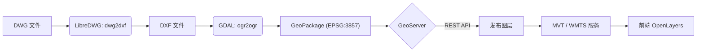

# DWG 转切片 (DWG to MVT)

基于 LibreDWG + GDAL + GeoServer 的 CAD 图纸发布解决方案。
将上传的 DWG 文件通过后端转换为 DXF/GeoPackage，并发布为 GeoServer 矢量切片（MVT），前端使用 OpenLayers 加载显示。

## 功能特性

*   **DWG 解析**：使用 LibreDWG 将 DWG 转换为 DXF。
*   **空间数据转换**：使用 GDAL/OGR 将 DXF 转换为带空间参考（EPSG:3857）的 GeoPackage。
*   **自动发布**：通过 GeoServer REST API 自动创建工作区、数据存储并发布图层。
*   **矢量切片**：支持 MVT (Mapbox Vector Tiles) 输出，高性能前端渲染。
*   **样式优化**：自动处理 CAD 文本编码、对齐方式，并优化栅格化显示效果。

## 工作流程



## 环境要求

*   **操作系统**：Windows / Linux / macOS
*   **核心组件**：
    *   **LibreDWG**：提供 `dwg2dxf` 工具。
    *   **GDAL**：提供 `ogr2ogr` 工具。
    *   **GeoServer**：用于发布地图服务（建议 2.24+，需安装 GeoPackage 扩展）。
*   **开发环境**：
    *   **后端**：Python 3.11+
    *   **前端**：Node.js 18+

## 快速开始

### 1. 安装依赖工具

#### Windows
请参考详细指南：[Windows 安装 LibreDWG 与 GDAL](./backend/安装LibreDWG与GDAL-Windows.md)

#### Linux (Ubuntu/Debian)
```bash
sudo apt install libredwg-bin gdal-bin
```

#### macOS
```bash
brew install libredwg gdal
```

### 2. 启动后端服务

进入 `backend` 目录：

**Windows (推荐)**
直接运行 `start.bat`。

**Linux / macOS**
```bash
cd backend
chmod +x setup.sh run.sh
./setup.sh  # 首次运行安装依赖
./run.sh    # 启动服务
```

更多启动方式请参考：[后端启动说明](./backend/启动说明.md)

API 文档地址：http://localhost:8000/docs

### 3. 启动前端应用

进入 `frontend` 目录：

```bash
cd frontend
npm install
npm run dev
```

浏览器访问：http://localhost:5173

### 4. GeoServer 配置

1.  安装 [GeoServer](https://geoserver.org/) 并启动。
2.  安装 **GeoPackage 扩展**。
3.  在后端 `.env` 文件中配置 GeoServer 连接信息：
    ```env
    APP_GEOSERVER_URL=http://localhost:8080/geoserver
    APP_GEOSERVER_USER=admin
    APP_GEOSERVER_PASSWORD=geoserver
    ```
4.  确保后端生成的 `data` 目录对 GeoServer 可见（若在 Docker 中需挂载卷）。

## 项目结构

```
LibreDWG/
├── backend/                 # Python FastAPI 后端
│   ├── app/
│   │   ├── services/        # 核心业务逻辑
│   │   │   ├── conversion.py      # DWG -> GPKG 转换逻辑
│   │   │   └── geoserver_client.py # GeoServer 自动发布逻辑
│   ├── tools/               # Windows 下存放便携版工具的目录
│   └── start.bat            # Windows 启动脚本
├── frontend/                # React + TypeScript + OpenLayers 前端
│   ├── src/
│   │   ├── Map.tsx          # 地图组件
│   │   └── Uploader.tsx     # 上传组件
└── README.md                # 项目说明
```

## 常见问题

*   **转换卡顿/失败**：检查 DWG 文件版本，尝试使用更高版本的 LibreDWG。
*   **文字乱码**：通常是由于编码识别错误，后端会自动尝试 UTF-8 转换，也可手动指定编码。
*   **GeoServer 500 错误**：检查 GeoPackage 扩展是否安装，以及图层名称是否包含非法字符。

## 许可证

本项目代码开源，具体依赖组件遵循各自协议：
*   LibreDWG: GPLv3
*   GDAL: MIT
*   GeoServer: GPLv2
