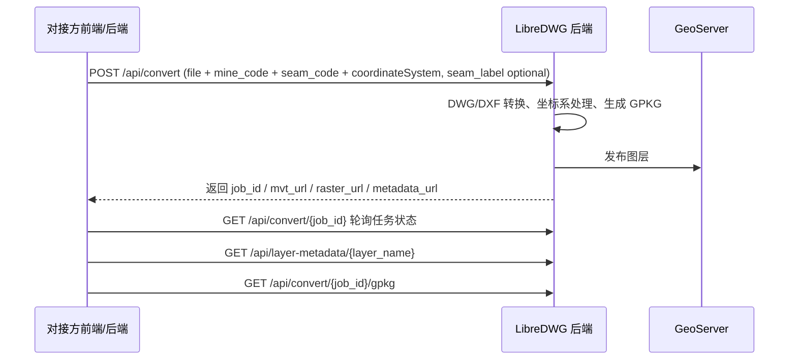

# LibreDWG 图纸上传与切片对接文档

## 1. 目标

本项目负责接收图纸文件，完成 DWG/DXF 转换、坐标系处理、GeoPackage 生成、GeoServer 发布，并向调用方返回可用于预览的切片地址与元数据地址。

对接方只需要按本文档提交参数，并按返回值进行轮询和渲染即可。

## 2. 安全要求

所有接口和所有资源访问都必须携带 Token。

### 2.1 推荐的 Token 传递方式

统一使用 HTTP 请求头：

```http
Authorization: Bearer <token>
```

### 2.2 必须加 Token 的资源

以下请求都必须携带 Token，不能通过直接输入 URL 的方式裸访问：

- 上传转换接口
- 任务状态查询接口
- 图层元数据接口
- GPKG 文件下载接口
- 切片地址对应的所有请求

### 2.3 安全落地建议

如果切片地址最终落到 GeoServer 或反向代理上，建议在网关、Nginx 或后端代理层先校验 Token，再转发到 GeoServer。

不建议直接把 GeoServer 公网暴露出来，否则用户仍然可能通过直接输入切片 URL 绕过业务鉴权。

## 3. 接口总览

| 方法 | 路径 | 说明 |
|---|---|---|
| `POST` | `/api/convert` | 上传图纸并开始转换发布 |
| `GET` | `/api/convert/{job_id}` | 查询任务状态 |
| `GET` | `/api/status/{job_id}` | 查询任务状态，等同于上一个接口 |
| `GET` | `/api/jobs` | 任务列表 |
| `GET` | `/api/layers/{job_id}` | 获取 GPKG 中的图层信息 |
| `GET` | `/api/layer-metadata/{layer_name}` | 获取图层显隐与颜色元数据 |
| `GET` | `/api/coordinate-systems` | 获取坐标系字典 |
| `GET` | `/api/convert/{job_id}/gpkg` | 下载 GPKG 文件 |

## 4. 上传接口

### 4.1 请求地址

`POST /api/convert`

### 4.2 请求类型

`multipart/form-data`

### 4.3 必填字段

| 字段名 | 类型 | 说明 |
|---|---|---|
| `file` | 文件 | 图纸文件，支持 `.dwg` 或 `.dxf` |
| `mine_code` | string | 煤矿编码 |
| `coordinateSystem` | string | 坐标系编码，取自 `/api/coordinate-systems` 的 `dictCode` |
| `seam_code` | string | 图层编码 / 煤层编码 |
| `seam_label` | string | 图层显示名称 / 煤层名称，**可不传** |

### 4.4 请求示例

```bash
curl -X POST "http://<host>/api/convert" \
  -H "Authorization: Bearer <token>" \
  -F "file=@demo.dwg" \
  -F "mine_code=000000704" \
  -F "coordinateSystem=2414" \
  -F "seam_code=mi00"
```

### 4.5 返回值说明

接口会立即返回任务对象，任务通常处于 `converting` 或 `publishing` 状态，完成后变为 `done`。

返回字段示例：

| 字段名 | 说明 |
|---|---|
| `job_id` | 任务 ID |
| `status` | `pending` / `converting` / `publishing` / `done` / `error` |
| `progress` | 0-100 |
| `message` | 当前状态或错误信息 |
| `dxf_path` | 转换后的 DXF 文件路径 |
| `gpkg_path` | 转换后的 GeoPackage 路径 |
| `layer_name` | 发布后的图层名 |
| `mine_code` | 煤矿编码 |
| `seam_code` | 图层编码 / 煤层编码 |
| `seam_label` | 图层显示名称 / 煤层名称，可能为空 |
| `coordinate_system` | 坐标系编码 |
| `mvt_url` | 矢量切片地址 |
| `raster_url` | 栅格切片地址 |
| `wmts_url` | WMTS capabilities 地址 |
| `metadata_url` | 图层元数据地址 |
| `bbox` | 图层范围 `[minx, miny, maxx, maxy]`，EPSG:4326 |

### 4.6 返回示例

```json
{
  "job_id": "4f5b0c0f1d1141d5b7d4a7f4f8d4a9f6",
  "status": "done",
  "progress": 100,
  "message": "Conversion and publish done",
  "layer_name": "layer_000000704_mi00",
  "mine_code": "000000704",
  "seam_code": "mi00",
  "seam_label": null,
  "coordinate_system": "2414",
  "mvt_url": "/csrap_geoserver/gwc/service/wmts?layer=dwg%3Alayer_000000704_mi00&tilematrixset=EPSG:900913&Service=WMTS&Request=GetTile&Version=1.0.0&Format=application/vnd.mapbox-vector-tile&TileMatrix=EPSG:900913:14&TileRow=6374&TileCol=13402",
  "raster_url": "/csrap_geoserver/gwc/service/wmts?layer=dwg%3Alayer_000000704_mi00&tilematrixset=EPSG:900913&Service=WMTS&Request=GetTile&Version=1.0.0&Format=image/png&TileMatrix=EPSG:900913:14&TileRow=6374&TileCol=13402",
  "wmts_url": "/csrap_geoserver/gwc/service/wmts?request=GetCapabilities",
  "metadata_url": "/api/layer-metadata/layer_000000704_mi00",
  "bbox": [114.44, 37.02, 114.48, 37.04]
}
```

## 5. 任务状态查询

### 5.1 查询接口

- `GET /api/convert/{job_id}`
- `GET /api/status/{job_id}`

两个接口等价。

### 5.2 返回说明

建议调用方在上传后轮询该接口，直到：

- `status = done`：转换和发布成功
- `status = error`：转换失败，读取 `message` 查看原因

## 6. 图层与元数据

### 6.1 图层列表

`GET /api/layers/{job_id}`

返回 GPKG 中可用图层列表，用于查看上传后的图层结构。

### 6.2 图层元数据

`GET /api/layer-metadata/{layer_name}`

这个接口返回单个图层的显示元数据，主要用于 GIS 前端回显：

- `visible`：是否显示
- `lineColor`：线颜色
- `textColor`：文字颜色
- `kind`：图层类型（line / text / both）

### 6.3 元数据文件命名

图层元数据按 `layer_name` 命名，例如：

```text
layer_000000704_mi00.json
```

## 7. 坐标系接口

### 7.1 接口

`GET /api/coordinate-systems`

### 7.2 使用方式

对接方应先拉取该接口，把返回列表中的 `dictCode` 作为 `coordinateSystem` 提交给 `/api/convert`。

`dictName` 仅用于展示，真正传参请使用 `dictCode`。

## 8. 文件下载

### 8.1 GPKG 下载

`GET /api/convert/{job_id}/gpkg`

返回转换后的 GeoPackage 文件。

### 8.2 访问限制

该接口同样必须携带 Token。

## 9. 切片地址

转换成功后，后端会返回可直接用于前端渲染的切片地址：

- `mvt_url`
- `raster_url`
- `wmts_url`
- `metadata_url`

### 9.1 重要说明

这些地址是“业务返回地址”，不是公开裸链。

调用方如果要直接请求这些资源，必须在请求头中带上 Token，且服务端或网关必须验证通过后才允许返回内容。

### 9.2 前端接入建议

如果前端地图组件本身不能方便地给每个切片请求加请求头，建议：

1. 通过同域反向代理统一转发
2. 或者由业务后端代为请求后再透传

不要把 GeoServer 地址直接暴露给终端用户。

## 10. 调用流程



## 11. 对接注意事项

1. `coordinateSystem` 必须取自 `/api/coordinate-systems` 返回的 `dictCode`。
2. 上传文件支持 `.dwg` 和 `.dxf`。
3. `seam_label` 可不传，只要 `seam_code` 即可。
4. 所有接口和所有资源请求都要加 Token。
5. 如果切片或文件能直接通过 URL 打开，说明鉴权链路还没有接好，需要优先修正。

## 12. 当前实现补充

目前项目内部已经支持：

- 图纸上传转换
- 图层元数据导出
- 切片地址返回
- 坐标系字典接口

如需在网关层进一步限制 GeoServer 直连访问，建议单独加一层统一鉴权代理。

